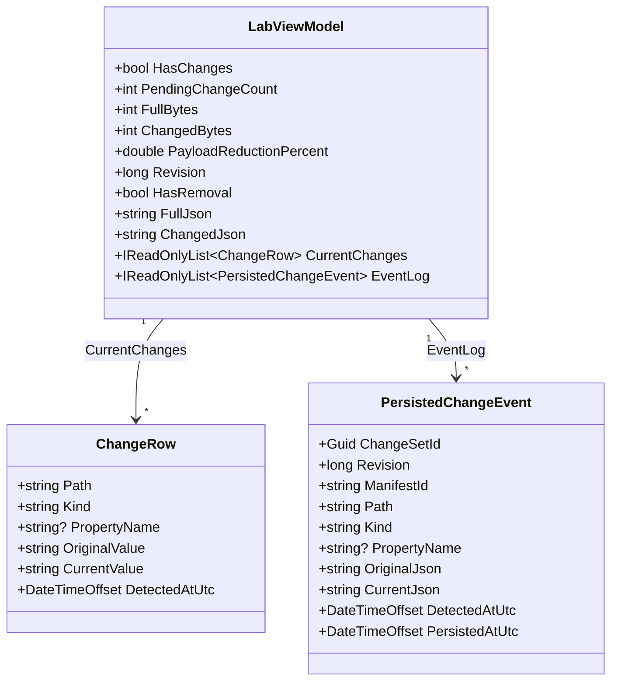

# Models

Data-transfer records that carry change-tracking state from the `Services` layer to the Razor Page. Nothing in this folder touches the IIIF SDK directly — it only shapes the values the SDK already produced.

## Files

| File | Types |
| --- | --- |
| [`ChangeModels.cs`](../../Models/ChangeModels.cs) | `ChangeRow`, `PersistedChangeEvent`, `LabViewModel` |

## Types & Members

### `ChangeRow`

Immutable record for one pending change, formatted for display.

| Member | Type | Description |
| --- | --- | --- |
| `Path` | `string` | Path from the Manifest root to the changed node (e.g. `Items[0].Height`). |
| `Kind` | `string` | String form of the SDK's `IiifChangeKind`. |
| `PropertyName` | `string?` | Name of the changed property, when the change is a scalar property change. |
| `OriginalValue` | `string` | Pre-change value, formatted by [`ChangeValueFormatter.ToDisplayValue`](../Services/README.md#changevalueformatter). |
| `CurrentValue` | `string` | Post-change value, formatted the same way. |
| `DetectedAtUtc` | `DateTimeOffset` | Timestamp the SDK recorded when the change occurred. |

### `PersistedChangeEvent`

Immutable record for one committed change, written to the in-memory event log by [`ChangeTrackingLabService.CommitDelta`](../Services/README.md#changetrackinglabservice).

| Member | Type | Description |
| --- | --- | --- |
| `ChangeSetId` | `Guid` | Identifier shared by every event committed in the same batch. |
| `Revision` | `long` | Revision number the batch was committed under. |
| `ManifestId` | `string` | `RootId` of the ChangeSet the event came from. |
| `Path` | `string` | Path from the Manifest root to the changed node. |
| `Kind` | `string` | String form of the SDK's `IiifChangeKind`. |
| `PropertyName` | `string?` | Name of the changed property, when applicable. |
| `OriginalJson` | `string` | Pre-change value as stable JSON. |
| `CurrentJson` | `string` | Post-change value as stable JSON. |
| `DetectedAtUtc` | `DateTimeOffset` | Timestamp the SDK recorded when the change occurred. |
| `PersistedAtUtc` | `DateTimeOffset` | Timestamp the change was committed to the event log. |

### `LabViewModel`

Mutable-free view model bound to `Pages/Index.cshtml`.

| Member | Type | Description |
| --- | --- | --- |
| `HasChanges` | `bool` | Mirrors `Manifest.HasChanges`. |
| `PendingChangeCount` | `int` | Count of rows in `CurrentChanges`. |
| `FullBytes` | `int` | UTF-8 byte length of the full Manifest serialization. |
| `ChangedBytes` | `int` | UTF-8 byte length of the changed-only serialization. |
| `PayloadReductionPercent` | `double` | Percentage reduction of `ChangedBytes` versus `FullBytes`. |
| `Revision` | `long` | Number of commits accepted so far in the session. |
| `HasRemoval` | `bool` | True when a pending change is a `CollectionItemRemoved`. |
| `FullJson` | `string` | Full Manifest, serialized. |
| `ChangedJson` | `string` | Changed-only Manifest, serialized. |
| `CurrentChanges` | `IReadOnlyList<ChangeRow>` | Pending changes not yet committed. |
| `EventLog` | `IReadOnlyList<PersistedChangeEvent>` | Committed changes, newest first. |

## Diagram



## Usage recipe

Building a `LabViewModel` from a session is a single call to [`ChangeTrackingLabService.BuildView`](../Services/README.md#changetrackinglabservice):

```csharp
LabViewModel lab = ChangeTrackingLabService.BuildView(session);
```

`session.Manifest.GetChanges()` results feed `CurrentChanges`; the session's own `EventLog` feeds `EventLog` directly.
