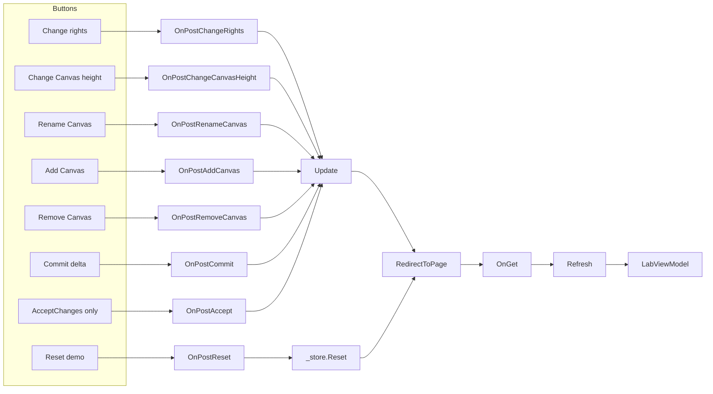

# Pages

The single Razor Page that hosts the demo: a page model that dispatches each button's POST to a [`Services`](../Services/README.md#changetrackinglabservice) mutation, and the markup that renders the resulting [`LabViewModel`](../Models/README.md#labviewmodel).

## Files

| File | Types |
| --- | --- |
| [`Index.cshtml.cs`](../../Pages/Index.cshtml.cs) | `IndexModel` |
| [`Index.cshtml`](../../Pages/Index.cshtml) | Markup for `IndexModel` |
| [`_ViewImports.cshtml`](../../Pages/_ViewImports.cshtml) | Shared `@using`/`@namespace`/tag-helper directives |
| [`_ViewStart.cshtml`](../../Pages/_ViewStart.cshtml) | Disables the layout (`Layout = null`) |

## Types & Members

### `IndexModel`

`[ResponseCache(NoStore = true, Location = ResponseCacheLocation.None)]` page model backing `Index.cshtml`. One instance per request; session state lives in `ChangeTrackingSessionStore`, not on the model.

| Member | Description |
| --- | --- |
| `Lab` | `LabViewModel` bound to the page, populated by `Refresh()`. |
| `SessionId` *(private)* | Reads `ChangeTrackingLab.SessionId` from `HttpContext.Session`, seeding it from `HttpContext.Session.Id` on first access. |
| `OnGet()` | Calls `Refresh()`. |
| `OnPostChangeRights()` | Dispatches `ChangeTrackingLabService.ChangeRights`. |
| `OnPostChangeCanvasHeight()` | Dispatches `ChangeTrackingLabService.ChangeFirstCanvasHeight`. |
| `OnPostRenameCanvas()` | Dispatches `ChangeTrackingLabService.RenameSecondCanvas`. |
| `OnPostAddCanvas()` | Dispatches `ChangeTrackingLabService.AddCanvas`. |
| `OnPostRemoveCanvas()` | Dispatches `ChangeTrackingLabService.RemoveLastCanvas`. |
| `OnPostCommit()` | Dispatches `ChangeTrackingLabService.CommitDelta`. |
| `OnPostAccept()` | Calls `state.Manifest.AcceptChanges()` directly, without touching the event log. |
| `OnPostReset()` | Calls `_store.Reset(SessionId)` and redirects. |
| `Refresh()` *(private)* | Sets `Lab` from `_store.Read(SessionId, ChangeTrackingLabService.BuildView)`. |
| `Update(Action<ChangeTrackingSession>)` *(private)* | Shared helper: `_store.Update(SessionId, update)` then `RedirectToPage()`. Every `OnPost*` handler except `OnPostReset` funnels through this. |

### `Index.cshtml`

Renders `Model.Lab` into:

- a status grid (`HasChanges`, pending count, full/changed byte counts, payload reduction %, committed revisions)
- a button row wired to each `asp-page-handler`
- a removal warning when `Model.Lab.HasRemoval` is true
- a pending-ChangeSet table (`Model.Lab.CurrentChanges`)
- side-by-side `<pre>` blocks for the full and changed-only Manifest JSON
- an event-log table (`Model.Lab.EventLog`)

A page-local `Shorten` helper (`@functions` block) truncates event-log JSON snapshots to 150 characters for display.

## Diagram

## Usage recipe

Adding a new demo action means three changes, all in this pair of files plus `Services`:

1. Add a static method to `ChangeTrackingLabService` that takes a `ChangeTrackingSession` and mutates `state.Manifest`.
2. Add an `OnPost<Name>` handler to `IndexModel` that calls `Update(ChangeTrackingLabService.<Name>)`.
3. Add a `<button asp-page-handler="<Name>">` to `Index.cshtml`.
