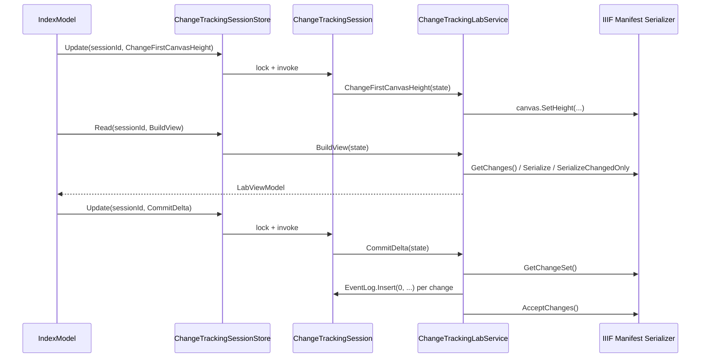

# Services

The application logic that sits between the Razor Page and the IIIF Manifest Serializer SDK: session storage, the mutations the demo buttons trigger, JSON formatting for display, and the sample Manifest the demo starts from.

## Files

| File | Types |
| --- | --- |
| [`ChangeTrackingLabService.cs`](../../Services/ChangeTrackingLabService.cs) | `ChangeTrackingLabService` |
| [`ChangeTrackingSessionStore.cs`](../../Services/ChangeTrackingSessionStore.cs) | `ChangeTrackingSession`, `ChangeTrackingSessionStore` |
| [`ChangeValueFormatter.cs`](../../Services/ChangeValueFormatter.cs) | `ChangeValueFormatter` |
| [`SampleManifestFactory.cs`](../../Services/SampleManifestFactory.cs) | `SampleManifestFactory` |

## Package dependencies

| Package | Used for |
| --- | --- |
| `IIIF.Manifest.Serializer.Net` | `Manifest`, `Canvas`, `Label`, `Rights`, `IiifSerializer`, `IiifChangeKind`, and the SDK's change-tracking API (`GetChanges`, `GetChangeSet`, `AcceptChanges`, `ClearChanges`). |
| `Newtonsoft.Json` (transitive, via the SDK) | `ChangeValueFormatter`'s stable JSON output. |
| `Microsoft.Extensions.Caching.Memory` | `ChangeTrackingSessionStore`'s `IMemoryCache`-backed session storage. |

## Types & Members

### `ChangeTrackingLabService`

Static class holding every mutation the demo page can trigger, plus the view-model builder. Every method takes the session's `ChangeTrackingSession` directly and mutates its `Manifest`.

| Member | Description |
| --- | --- |
| `BuildView(ChangeTrackingSession state)` | Builds a `LabViewModel`: reads `state.Manifest.GetChanges()`, serializes the full and changed-only Manifest, and computes payload-reduction percentage. |
| `ChangeRights(ChangeTrackingSession state)` | Sets the Manifest's `Rights` to `Rights.CcBy`. |
| `ChangeFirstCanvasHeight(ChangeTrackingSession state)` | Adds 100 to the first `Canvas`'s height. |
| `RenameSecondCanvas(ChangeTrackingSession state)` | Relabels the second `Canvas` with a timestamped label. |
| `AddCanvas(ChangeTrackingSession state)` | Appends a new `Canvas`, numbered from `state.AddedCanvasCounter`. |
| `RemoveLastCanvas(ChangeTrackingSession state)` | Removes the last `Canvas` from the Manifest. |
| `CommitDelta(ChangeTrackingSession state)` | Reads `GetChangeSet()`, appends one `PersistedChangeEvent` per change to `state.EventLog`, increments `state.Revision`, then calls `AcceptChanges()`. No-ops when the ChangeSet is empty. |

### `ChangeTrackingSession`

Per-session state: the Manifest under test, its committed event log, the current revision counter, and a counter used to number newly added canvases.

| Member | Type | Description |
| --- | --- | --- |
| `Manifest` | `Manifest` | Created via `SampleManifestFactory.Create()` when the session is constructed. |
| `EventLog` | `List<PersistedChangeEvent>` | Committed changes, newest inserted at index 0. |
| `Revision` | `long` | Number of commits accepted so far. |
| `AddedCanvasCounter` | `int` | Starts at 4 (the sample Manifest ships 3 canvases) and increments on each `AddCanvas` call. |

### `ChangeTrackingSessionStore`

Singleton service that maps an ASP.NET Core session ID to a `ChangeTrackingSession`, backed by `IMemoryCache`.

| Member | Description |
| --- | --- |
| `IdleTimeout` | `static readonly TimeSpan`, 20 minutes. Used both as the cache-entry sliding expiration and as `SessionOptions.IdleTimeout` in `Program.cs`. |
| `Read<TResult>(sessionId, reader)` | Locks the session object and runs `reader` against it, returning the result. |
| `Update(sessionId, update)` | Locks the session object and runs `update` against it. |
| `Reset(sessionId)` | Replaces the session with a fresh `ChangeTrackingSession`. |
| `GetOrCreate(sessionId)` *(private)* | Double-checked lookup/creation against the cache, guarded by `_creationLock`. |

### `ChangeValueFormatter`

Static helpers that turn arbitrary change values into JSON safe for HTML display.

| Member | Description |
| --- | --- |
| `ToStableJson(object? value)` | Serializes with `ReferenceLoopHandling.Ignore` and `NullValueHandling.Ignore`; returns `"null"` for a null value and falls back to a quoted `ToString()` if serialization throws. |
| `ToDisplayValue(object? value, int maxLength = 180)` | Calls `ToStableJson` and truncates the result to `maxLength` characters, appending `…`. |

### `SampleManifestFactory`

| Member | Description |
| --- | --- |
| `Create()` | Builds a `Manifest` with three canvases (1200×900, labeled "Page 1"–"Page 3"), then calls `ClearChanges()` so the returned Manifest starts with an empty tracking baseline. |

## Diagram



## Usage recipes

Reading the current view model for a session:

```csharp
var lab = store.Read(sessionId, ChangeTrackingLabService.BuildView);
```

Applying a mutation and re-rendering:

```csharp
store.Update(sessionId, ChangeTrackingLabService.AddCanvas);
return RedirectToPage();
```

Committing the pending ChangeSet to the event log and resetting the tracking baseline:

```csharp
store.Update(sessionId, ChangeTrackingLabService.CommitDelta);
```
